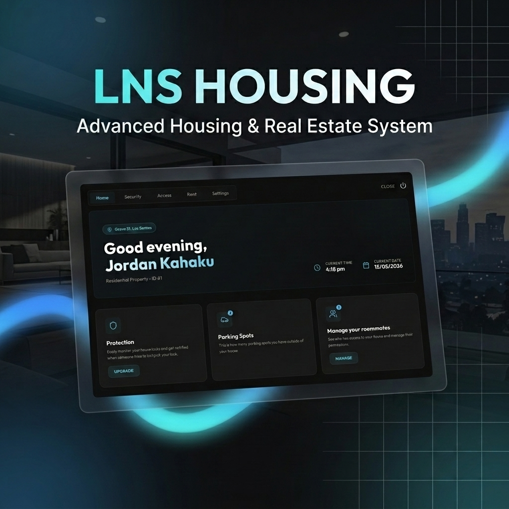

<div align="center">
  <h1>LNS Housing</h1>

  [](https://github.com/LumaNodeStudios/LNS_Housing)
  [](#-framework-compatibility)
  [](https://github.com/LumaNodeStudios)
  [](LICENSE)
</div>

---

## Preview



---

## Overview

**LNS Housing** by **LumaNode Studios** is a state-of-the-art, feature-complete housing and real estate system designed for FiveM servers. It completely replaces legacy, unoptimized housing resources with a modern, database-backed solution.

Rather than just a simple spawn-and-teleport script, **LNS Housing** introduces deep, immersive mechanics: **interactive furniture shop and placement**, a **dynamic lawn growth and mowing system**, **real estate agency job flows** with contracts and employee permissions, and a highly optimized **starter apartments framework** with seamless spawn integrations.

---

## Features

### Advanced Property Management & Editing
* **In-Game House Creator:** Admin commands (`/createhouse`) to quickly define shell locations, entrance/exit coordinates, pricing, and allowed agencies.
* **MLO & Shell support:** Built-in tools for both MLO-based houses and traditional teleporting shell interiors.
* **Wall Colors & Customization:** Real-time interior wall painting/color selection, allowing players to truly personalize their houses.

### Interactive Furniture & Shop
* **Rich Furniture Catalog:** Dozens of pre-configured furniture props across sofas, chairs, beds, tables, storage containers, lights, and decor.
* **Dynamic Placement UI:** Smooth translation, rotation, and height adjustment tools to position props precisely in-game.
* **Stashes & Wardrobes:** Place storage crates, lockers, wardrobes, or safes anywhere. Placing storage furniture automatically registers the containers with the inventory system.

### Dynamic Lawn Mower & Yard System
* **Grass Growth:** Grass props spawn dynamically in designated yard zones, growing in height over time.
* **Lawn Maintenance:** Players must mow their yard using a lawnmower item or drivable mower vehicles to maintain their properties.
* **Yard Customization:** Define specific lawn zone boundaries for any property using the built-in zone editor.

### Real Estate & Contracts
* **Agent Dashboard:** Real estate agents access a custom panel (`/properties`) to manage listings, adjust pricing, and hire employees.
* **Draft Purchase Contracts:** Draft legal agreements specifying commission rates, deposit requirements, and buyer parameters.
* **Agency Permissions:** Granular agent grades control access to creating listings, editing details, managing employees, or drafting contracts.

### Security & Raids
* **Lockpicking:** Immersive minigame to lockpick house and apartment doors.
* **Police Breaches:** Authorize law enforcement agents to raid properties, bypass door locks, and search stashes under active warrants.

---

## Framework Compatibility

LNS Housing features automatic framework detection, providing full support for:
* **Qbox** (`qbx_core`)
* **ESX** (`es_extended`)

---

## Requirements

Ensure you have the following resources installed and started before running LNS Housing:
* [ox_lib](https://github.com/overextended/ox_lib) (version 3.22.0 or higher)
* [oxmysql](https://github.com/overextended/oxmysql) (for database integrations)
* [ox_inventory](https://github.com/overextended/ox_inventory) (highly recommended, or equivalent bridge)
* [ox_doorlock](https://github.com/overextended/ox_doorlock) (integrated door locking system)

---

## Database Setup

LNS Housing will automatically attempt to create its required tables and handle migrations on startup. If you prefer to manually run the SQL schema, import the following into your database:

```sql
CREATE TABLE IF NOT EXISTS `housing_properties` (
    `id` INT AUTO_INCREMENT PRIMARY KEY,
    `label` VARCHAR(100) NOT NULL,
    `price` INT NOT NULL DEFAULT 0,
    `owner` VARCHAR(60) DEFAULT NULL,
    `door_id` INT DEFAULT NULL,
    `permissions` LONGTEXT DEFAULT '{"entry":[], "storage":[], "wardrobe":[], "manage":[]}',
    `metadata` LONGTEXT DEFAULT '{"power": 0, "water": 0, "wall_color": 0, "allow_wall_colors": false}',
    `furniture` LONGTEXT DEFAULT '[]',
    `doors` LONGTEXT DEFAULT '[]',
    `image` LONGTEXT DEFAULT NULL,
    `sale_type` VARCHAR(20) DEFAULT 'direct',
    `auction_data` LONGTEXT DEFAULT '{"current_bid": 0, "highest_bidder": null, "status": "paused"}',
    `zone_data` LONGTEXT DEFAULT '{"points":[], "thickness": 10.0}',
    `yard_zone_data` LONGTEXT DEFAULT NULL,
    `last_mowed` INT DEFAULT 0,
    `lawn_data` LONGTEXT DEFAULT NULL,
    `agency` VARCHAR(50) DEFAULT NULL,
    `agent_cid` VARCHAR(50) DEFAULT NULL,
    `commission_rate` INT DEFAULT 10,
    `created_at` TIMESTAMP DEFAULT CURRENT_TIMESTAMP
) ENGINE=InnoDB DEFAULT CHARSET=utf8mb4;

CREATE TABLE IF NOT EXISTS `housing_stashes` (
    `id` VARCHAR(100) PRIMARY KEY,
    `property_id` INT NOT NULL,
    `data` LONGTEXT DEFAULT '{}',
    FOREIGN KEY (`property_id`) REFERENCES `housing_properties`(`id`) ON DELETE CASCADE
) ENGINE=InnoDB DEFAULT CHARSET=utf8mb4;

CREATE TABLE IF NOT EXISTS `player_apartments` (
    `id` INT AUTO_INCREMENT PRIMARY KEY,
    `citizenid` VARCHAR(50) NOT NULL,
    `room_id` INT NOT NULL,
    `is_new` TINYINT(1) DEFAULT 1,
    `assigned_at` TIMESTAMP DEFAULT CURRENT_TIMESTAMP,
    UNIQUE KEY `unique_citizen` (`citizenid`)
) ENGINE=InnoDB DEFAULT CHARSET=utf8mb4;

CREATE TABLE IF NOT EXISTS `apartments` (
    `id` INT AUTO_INCREMENT PRIMARY KEY,
    `citizenid` VARCHAR(50) NOT NULL,
    `room_id` INT NOT NULL,
    `permissions` LONGTEXT DEFAULT '{"entry":[], "storage":[], "wardrobe":[], "manage":[]}',
    `furniture` LONGTEXT DEFAULT '[]',
    `wall_color` INT DEFAULT 0,
    `created_at` TIMESTAMP DEFAULT CURRENT_TIMESTAMP,
    UNIQUE KEY `unique_citizen_room` (`citizenid`, `room_id`)
) ENGINE=InnoDB DEFAULT CHARSET=utf8mb4;

CREATE TABLE IF NOT EXISTS `apartment_rooms` (
    `id` INT PRIMARY KEY,
    `corners` LONGTEXT NOT NULL,
    `thickness` FLOAT NOT NULL DEFAULT 3.5,
    `zOffset` FLOAT NOT NULL DEFAULT 0.0,
    `door_model` INT DEFAULT NULL,
    `door_coords` LONGTEXT DEFAULT NULL,
    `door_heading` FLOAT DEFAULT NULL,
    `spawn_coords` LONGTEXT NOT NULL,
    `price` INT NOT NULL DEFAULT 0,
    `is_starter` TINYINT(1) DEFAULT 1,
    `created_at` TIMESTAMP DEFAULT CURRENT_TIMESTAMP
) ENGINE=InnoDB DEFAULT CHARSET=utf8mb4;

CREATE TABLE IF NOT EXISTS `housing_contracts` (
    `id` INT AUTO_INCREMENT PRIMARY KEY,
    `property_id` INT NOT NULL,
    `client_cid` VARCHAR(50) NOT NULL,
    `client_name` VARCHAR(100) DEFAULT 'Unknown',
    `agent_cid` VARCHAR(50) NOT NULL,
    `agent_name` VARCHAR(100) DEFAULT 'Unknown',
    `agency` VARCHAR(50) NOT NULL,
    `price` INT NOT NULL,
    `type` VARCHAR(20) NOT NULL,
    `status` VARCHAR(20) DEFAULT 'pending',
    `created_at` TIMESTAMP DEFAULT CURRENT_TIMESTAMP,
) ENGINE=InnoDB DEFAULT CHARSET=utf8mb4;
```

---

## Installation

1. Drag and drop the `LNS_Housing` folder into your server's `resources` directory (preferably under a folder like `[scripts]` or `[lumadode]`).
2. Import the `housing.sql` schema if you have disabled auto-migrations, or let the script auto-initialize tables on startup.
3. Configure your framework preferences, keys, agencies, and styling options in [shared/settings.lua](file:///shared/settings.lua).
4. Add the following to your `server.cfg` to start the resource:
   ```cfg
   ensure LNS_Housing
   ```

---

## Starter Apartment Spawning Integration

To eliminate double-fading screens and allow players to choose their starter apartments or owned properties directly inside the spawn selection menu, configure the modifications below for your framework (**Qbox** or **ESX**).

> **Note:** LNS Housing auto-detects your framework. You only need the section that matches your server.

---

### Qbox (qbx_core / qbx_spawn)

#### Part A: Spawning Directly in Starter Apartments (`qbx_core`)
Update `qbx_core` to query the player's newly assigned apartment coordinates *before* spawning.


##### Edit: `qbx_core/client/character.lua`

1. Open `client/character.lua` and locate the function `spawnDefault()`. Replace it with:
```lua
local function spawnDefault() -- We use a callback to make the server wait on this to be done
    DoScreenFadeOut(500)

    while not IsScreenFadedOut() do
        Wait(0)
    end

    destroyPreviewCam()

    local spawnCoords = defaultSpawn
    local isStarterApartment = false
    local assignedRoom = nil

    -- Custom starter apartment direct spawn integration
    if GetResourceState('LNS_Housing') == 'started' then
        assignedRoom = lib.callback.await('LNS_Housing:server:getMyApartment', false)
        if assignedRoom and assignedRoom.roomData then
            spawnCoords = assignedRoom.roomData.spawn
            isStarterApartment = true
        end
    end

    pcall(function() exports.spawnmanager:spawnPlayer({
        x = spawnCoords.x,
        y = spawnCoords.y,
        z = spawnCoords.z,
        heading = spawnCoords.w
    }) end)

    TriggerServerEvent('QBCore:Server:OnPlayerLoaded')
    TriggerEvent('QBCore:Client:OnPlayerLoaded')
    TriggerServerEvent('qb-houses:server:SetInsideMeta', 0, false)
    TriggerServerEvent('qb-apartments:server:SetInsideMeta', 0, 0, false)

    if isStarterApartment and assignedRoom then
        TriggerEvent('LNS_Housing:client:setApartmentData', assignedRoom.roomId, assignedRoom.roomData)
    end

    while not IsScreenFadedIn() do
        Wait(0)
    end
    TriggerEvent('qb-clothes:client:CreateFirstCharacter')
end
```

2. Scroll down in `client/character.lua` to the event `qbx_core:client:spawnNoApartments` and replace it with:
```lua
RegisterNetEvent('qbx_core:client:spawnNoApartments', function() -- This event is only for no starting apartments
    DoScreenFadeOut(500)
    Wait(2000)

    local spawnCoords = defaultSpawn
    local isStarterApartment = false
    local assignedRoom = nil

    -- Custom starter apartment direct spawn integration
    if GetResourceState('LNS_Housing') == 'started' then
        assignedRoom = lib.callback.await('LNS_Housing:server:getMyApartment', false)
        if assignedRoom and assignedRoom.roomData then
            spawnCoords = assignedRoom.roomData.spawn
            isStarterApartment = true
        end
    end

    destroyPreviewCam()
    SetEntityVisible(cache.ped, true, false)

    pcall(function() exports.spawnmanager:spawnPlayer({
        x = spawnCoords.x,
        y = spawnCoords.y,
        z = spawnCoords.z,
        heading = spawnCoords.w
    }) end)

    TriggerServerEvent('QBCore:Server:OnPlayerLoaded')
    TriggerEvent('QBCore:Client:OnPlayerLoaded')
    TriggerServerEvent('qb-houses:server:SetInsideMeta', 0, false)
    TriggerServerEvent('qb-apartments:server:SetInsideMeta', 0, 0, false)
    TriggerEvent('qb-weathersync:client:EnableSync')

    if isStarterApartment and assignedRoom then
        TriggerEvent('LNS_Housing:client:setApartmentData', assignedRoom.roomId, assignedRoom.roomData)
    end

    Wait(500)
    DoScreenFadeIn(250)

    TriggerEvent('qb-clothes:client:CreateFirstCharacter')
end)
```

##### Recommended Qbox Configuration Settings
1. **Disable Qbox Legacy Apartments (`qbx_core`):**
   Open `qbx_core/config/client.lua` and verify that `startingApartment` under the `characters` section is set to `false`:
   ```lua
   characters = {
       startingApartment = false, -- MUST BE FALSE (skips legacy apartments)
   }
   ```
2. **Remove `qbx_properties`:**
   Since `LNS_Housing` completely replaces the default housing, stashes, and wardrobes, you should disable/remove `qbx_properties`.

---

#### Part B: Spawn Menu Selection (`qbx_spawn`)

Allows returning players to select their starter apartments or owned properties directly inside the spawn selection menu.

##### Edit 1: `qbx_spawn/server/main.lua`
Open `server/main.lua` and locate the callback `'qbx_spawn:server:getProperties'`. Replace the entire callback with:
```lua
lib.callback.register('qbx_spawn:server:getProperties', function(source)
    local houseData = {}

    -- Support qbx_properties
    if GetResourceState('qbx_properties'):find('start') then
        local player = exports.qbx_core:GetPlayer(source)
        if player then
            local properties = MySQL.query.await('SELECT id, property_name, coords FROM properties WHERE owner = ?', { player.PlayerData.citizenid })
            for i = 1, #properties do
                local property = properties[i]
                houseData[#houseData + 1] = {
                    label = property.property_name,
                    coords = json.decode(property.coords),
                    propertyId = property.id,
                }
            end
        end
    end

    -- Support LNS_Housing (Apartments and Properties)
    if GetResourceState('LNS_Housing'):find('start') then
        local success, lnsSpawns = pcall(function()
            return exports.LNS_Housing:GetPlayerSpawns(source)
        end)
        if success and lnsSpawns then
            for i = 1, #lnsSpawns do
                local spawn = lnsSpawns[i]
                houseData[#houseData + 1] = {
                    label = spawn.label,
                    coords = spawn.coords,
                    lnsProperty = {
                        type = spawn.type,
                        id = spawn.id
                    }
                }
            end
        end
    end

    return houseData
end)
```

##### Edit 2: `qbx_spawn/client/main.lua`
Open `client/main.lua` and locate the submit key handler in the `inputHandler()` function (specifically around line 211, searching for `IsControlJustReleased(0, 191)`). Replace the block inside it with:
```lua
        elseif IsControlJustReleased(0, 191) then
            DoScreenFadeOut(1000)

            while not IsScreenFadedOut() do
                Wait(0)
            end

            TriggerServerEvent('QBCore:Server:OnPlayerLoaded')
            TriggerEvent('QBCore:Client:OnPlayerLoaded')
            FreezeEntityPosition(cache.ped, false)
            DisplayRadar(true)

            local spawnData = spawns[currentButtonId]

            -- Enter property/apartment based on framework support
            if spawnData.propertyId then
                TriggerServerEvent('qbx_properties:server:enterProperty', { id = spawnData.propertyId, isSpawn = true })
            elseif spawnData.lnsProperty then
                exports.LNS_Housing:SpawnInProperty(spawnData.lnsProperty.type, spawnData.lnsProperty.id)
            else
                SetEntityCoords(cache.ped, spawnData.coords.x, spawnData.coords.y, spawnData.coords.z, false, false, false, false)
                SetEntityHeading(cache.ped, spawnData.coords.w or 0.0)
            end

            DoScreenFadeIn(1000)

            break
```

---

### ESX (es_extended / esx_multicharacter)

ESX Legacy uses `esx_multicharacter` for character selection and `ESX.SpawnPlayer` for the final spawn. Integrate LNS Housing so **new characters** spawn inside their assigned starter apartment instead of `Config.DefaultSpawns`.

#### Part A: Spawning Directly in Starter Apartments (`esx_multicharacter`)

Update `esx_multicharacter` to resolve the player's apartment spawn coordinates before calling `ESX.SpawnPlayer`.

##### Edit: `esx_multicharacter/client/modules/multicharacter.lua`

Open `Multicharacter:PlayerLoaded` and replace the spawn selection block (from `local esxSpawns = ESX.GetConfig().DefaultSpawns` through `if not isNew and playerData.coords then`) with:

```lua
    local esxSpawns = ESX.GetConfig().DefaultSpawns
    local spawn = esxSpawns[math.random(1, #esxSpawns)]
    local isStarterApartment = false
    local assignedRoom = nil

    if not isNew and playerData.coords then
        spawn = playerData.coords
    elseif isNew and GetResourceState('LNS_Housing') == 'started' then
        assignedRoom = lib.callback.await('LNS_Housing:server:getMyApartment', false)
        if assignedRoom and assignedRoom.roomData and assignedRoom.roomData.spawn then
            local aptSpawn = assignedRoom.roomData.spawn
            spawn = {
                x = aptSpawn.x,
                y = aptSpawn.y,
                z = aptSpawn.z,
                heading = aptSpawn.w or aptSpawn.heading or 0.0,
            }
            isStarterApartment = true
        end
    end
```

Then locate the `ESX.SpawnPlayer(skin, spawn, function()` callback at the end of the same function. Inside that callback, **after** `DoScreenFadeIn(750)` and **before** `self:Reset()`, add:

```lua
        if isStarterApartment and assignedRoom then
            TriggerEvent('LNS_Housing:client:setApartmentData', assignedRoom.roomId, assignedRoom.roomData)
        end
```

##### Recommended ESX Configuration Settings

1. **Remove `esx_property`:**
   LNS Housing replaces default ESX property housing, stashes, and interiors. Remove `esx_property` from your server to avoid conflicts.

---

## Developer Exports & Docs

LNS Housing provides convenient exports to fetch and manipulate properties, apartments, and client zones:

### Server Exports

#### `GetProperties`
Returns an array of all loaded housing property records.
```lua
local properties = exports.LNS_Housing:GetProperties()
```

#### `GetProperty`
Fetches a specific property record using its database ID.
```lua
local property = exports.LNS_Housing:GetProperty(propertyId)
```

#### `GetPlayerSpawns`
Fetches all owned properties and starter apartments a specific player is allowed to spawn in.
```lua
local playerSpawns = exports.LNS_Housing:GetPlayerSpawns(playerId)
-- Returns array of { id, type = "apartment" | "house", label, coords }
```

---

### Client Exports

#### `PolyCreator`
Launches the poly zone builder GUI.
```lua
exports.LNS_Housing:PolyCreator()
```

#### `DoorPicker`
Launches the door scanner selector.
```lua
exports.LNS_Housing:DoorPicker()
```

#### `SpawnInProperty`
Spawns the client directly inside a house or apartment room.
```lua
exports.LNS_Housing:SpawnInProperty(type, id)
```

---

## Credits & Acknowledgements

**LNS Housing** is developed and distributed by **[LumaNode Studios](https://github.com/LumaNodeStudios)**. 

Special thanks to **[Project Sloth](https://github.com/Project-Sloth)** for their work on **[ps-housing](https://github.com/Project-Sloth/ps-housing)** and **[ps-realtor](https://github.com/Project-Sloth/ps-realtor)**, which served as reference and inspiration for some of the codebase's logic.

We also thank the wider FiveM developer community and the creators of **ox_lib** and **ox_doorlock** for providing key integration libraries that make this script lightweight and performant.

---

<div align="center">
  <p><i>A premium resource developed by <a href="https://github.com/LumaNodeStudios">LumaNode Studios</a></i></p>
</div>
